# Architecture

## Overview

`cosmic-applet-trash` is a COSMIC Desktop trash management applet built following native COSMIC patterns and Rust reactive programming principles.

## Core Design Principles

### 1. Native by Default

All integrations follow official COSMIC patterns discovered through source code analysis:

- **Process spawning**: Uses `std::process::Command` (not D-Bus) for launching applications
- **Icon handling**: Leverages COSMIC's adaptive icon system (colored in Dock, symbolic in Panel)
- **Subscriptions**: Follows `cosmic-files` patterns for filesystem monitoring

### 2. Modular Architecture

The codebase is organized into isolated, single-responsibility modules:

```
src/
├── app.rs              # Application orchestrator (state + messages)
├── trash_status.rs     # Backend: Trash monitoring logic
├── file_manager.rs     # Native integration: cosmic-files launcher
├── ui_panel_button.rs  # Frontend: Adaptive panel icon
├── ui_popup.rs         # Frontend: Popup content
├── config.rs           # Configuration management
├── i18n.rs             # Internationalization
├── lib.rs              # Public exports
└── main.rs             # Entry point
```

## Module Details

### Backend: Trash Status (`trash_status.rs`)

**Responsibility**: Pure trash state logic with no UI dependencies

**Key Functions**:
- `check()` - Queries trash status via `trash-rs` (cosmic branch)
- `icon_name_panel()` - Returns symbolic icon name
- `icon_name_dock()` - Returns colored icon name

**Data Flow**:
```
trash-rs API → TrashStatus::check() → { is_empty, item_count }
```

### Native Integration (`file_manager.rs`)

**Responsibility**: Launch cosmic-files with trash view

**Pattern**: Direct `Command::spawn("cosmic-files --trash")`  
**Reference**: `cosmic-files/cosmic-files-applet/src/file_manager.rs`

### Reactive UI (`ui_panel_button.rs`)

**Responsibility**: Context-aware icon rendering

**Adaptive Logic**:
```rust
match core.applet.panel_type {
    PanelType::Dock => {
        // Large colored icon (user-trash, user-trash-full)
        custom_button(colored_icon)
    }
    PanelType::Panel => {
        // Small symbolic icon (user-trash-symbolic, user-trash-full-symbolic)
        icon_button(symbolic_icon)
    }
}
```

**Discovery**: `core.applet.panel_type` API from `libcosmic/src/applet/mod.rs:67`

### Application Orchestrator (`app.rs`)

**Responsibility**: State management and message routing

**State**:
- `trash_status: TrashStatus` - Current trash state (reactive)
- `popup: Option<Id>` - Popup window handle
- `config: Config` - User preferences

**Messages**:
- `TogglePopup` - Show/hide popup
- `TrashStatusChanged(TrashStatus)` - Filesystem event notification
- `OpenTrashFolder` - Launch cosmic-files
- *(Future)* `EmptyTrash`, `RestoreItems`, `EjectDrive`, `UninstallApp`

## Event Flow: Real-Time Monitoring

### Phase 1: inotify Subscription

```mermaid
graph LR
    A[Filesystem Change] --> B[inotify event]
    B --> C[notify-debouncer-full<br/>250ms debounce]
    C --> D[TrashWatcherSubscription]
    D --> E[TrashStatus::check]
    E --> F[try_send Message::TrashStatusChanged]
    F --> G[AppModel::update]
    G --> H[self.trash_status = new_status]
    H --> I[View re-renders<br/>Iced reactive]
    I --> J[Icon updates automatically]
```



### Implementation Details

**Subscription Setup** (`app.rs:106-167`):
```rust
fn subscription(&self) -> Subscription<Self::Message> {
    let watcher_subscription = Subscription::run_with_id(
        TypeId::of::<TrashWatcherSubscription>(),
        stream::channel(1, |mut output| async move {
            let watcher = new_debouncer(
                Duration::from_millis(250),  // Debounce window
                Some(Duration::from_millis(250)),
                move |event_res| {
                    if should_rescan {
                        let new_status = TrashStatus::check();
                        output.try_send(Message::TrashStatusChanged(new_status))
                    }
                },
            );

            // Monitor trash folders
            watcher.watch(&trash_path, RecursiveMode::NonRecursive)
        }),
    );

    Subscription::batch(vec![
        config_watcher,
        watcher_subscription,  // ← Trash monitoring
    ])
}
```

**Key Design Choices**:

1. **250ms Debounce**: Prevents UI thrashing during bulk operations (e.g., deleting 10 files = 1-2 updates)
2. **`try_send` (non-blocking)**: Keeps watcher thread lightweight; acceptable to drop updates during backpressure
3. **`NonRecursive`**: Monitors only `~/.local/share/Trash/files/` root, not contents (performance)
4. **Batched subscriptions**: Config changes + Trash changes handled separately

### Performance Characteristics

| Scenario | Events | Updates | Latency |
|----------|--------|---------|---------|
| Single file delete | 1 | 1 | < 500ms |
| 10 rapid deletes | 10+ | 1-2 | < 750ms |
| Empty trash | N | 1 | < 500ms |

## COSMIC Integration Standards

### Icon System

**Dock Context** (colorized):
- Empty: `user-trash` → System provides colored version
- Full: `user-trash-full` → System provides colored version

**Panel Context** (symbolic):
- Empty: `user-trash-symbolic` → Monochrome, theme-aware
- Full: `user-trash-full-symbolic` → Monochrome, theme-aware

**Icon Discovery**: System icons from `/usr/share/icons/Cosmic/` (no manual installation needed)

### Applet Configuration

**Desktop File** (`data/com.github.thiagocys.CosmicAppletTrash.desktop`):
- `Icon=com.github.thiagocys.CosmicAppletTrash-symbolic` (suffix determines applet list behavior)
- `Categories=Utility;` (COSMIC applet category)

**Metainfo** (`data/com.github.thiagocys.CosmicAppletTrash.metainfo.xml`):
- Provides metadata for COSMIC App Store integration

## Future Phases

### Phase 2: Actions
- Empty Trash button (with confirmation dialog)
- Restore Items interface

### Phase 3: Disk Eject
- Drag & Drop disk icons to eject
- Integration with `udisks2` via D-Bus

### Phase 4: App Uninstall
- Drag & Drop app icons to uninstall
- Flatpak + PackageKit support

## Dependencies

### Core
- `libcosmic` - COSMIC UI framework
- `iced` - Reactive GUI (via libcosmic)
- `trash` (cosmic branch) - Trash operations
- `notify-debouncer-full` - Filesystem monitoring
- `tokio` - Async runtime

### Standards Compliance
- GPL-3.0 license
- Rust 2024 edition
- COSMIC applet API patterns
